# 🤖 Análisis Predictivo de Evasión de Clientes - TelecomX LATAM (Parte 2)

<div align="center">


_Un proyecto de Machine Learning de extremo a extremo para construir, evaluar e interpretar modelos predictivos que anticipan la evasión de clientes y guían las estrategias de retención._

[**🚀 Ver el Análisis**](#-ejecución-directa-en-colab) **|** [**📊 Principales Hallazgos**](#-principales-hallazgos-del-modelo) **|** [**💡 Recomendaciones**](#-recomendaciones-estratégicas)

</div>

---

## 🎯 Descripción del Proyecto

Este proyecto es la segunda fase del análisis de **TelecomX LATAM**, centrado en el desarrollo de un pipeline de Machine Learning para **predecir la evasión de clientes (churn)**. A partir de los datos históricos, se construye, evalúa e interpreta un modelo capaz de anticipar la cancelación de clientes y proponer acciones de retención basadas en datos.

El objetivo final no es solo predecir, sino **interpretar los resultados del mejor modelo** para entender *por qué* los clientes se van y proponer acciones de retención proactivas y basadas en datos.

### 🌟 Características Destacadas

- ✅ **Pipeline de Machine Learning de Extremo a Extremo:** Desde el preprocesamiento hasta la evaluación y la interpretabilidad del modelo.
- ✅ **Manejo Avanzado del Desbalance de Clases:** Uso de **SMOTE** (Synthetic Minority Over-sampling Technique) para entrenar modelos robustos y evitar el sesgo hacia la clase mayoritaria.
- ✅ **Comparación Robusta de Modelos:** Evaluación y comparación de `Regresión Logística`, `Random Forest` y `HistGradientBoosting` utilizando métricas clave como **ROC-AUC** y **Recall**.
- ✅ **Interpretabilidad del Modelo Avanzada:** Análisis profundo de los factores de churn utilizando **Permutation Importance** y **SHAP** (SHapley Additive exPlanations) para entender las predicciones.
- ✅ **Recomendaciones de Negocio Accionables:** Estrategias de retención directamente derivadas de los resultados del modelo predictivo.
- ✅ **Código Reproducible y Mejorado:** El notebook está documentado para una fácil ejecución y comprensión, incluyendo mejoras sobre el análisis original.

---

## 🚀 Inicio Rápido

### Prerrequisitos

- Python 3.8+
- Jupyter Notebook o Google Colab
- Conexión a internet

### Instalación

1. **Clona el repositorio:**
    ```bash
    git clone https://github.com/frenrey3/Desafio-TelecomX-Churn-Analysis-Parte2.git
    cd Desafio-TelecomX-Churn-Analysis-Parte2
    ```

2. **Instala las dependencias:**
    ```bash
    pip install -r requirements.txt
    ```
    *Nota: `requirements.txt` debería incluir `pandas`, `numpy`, `matplotlib`, `seaborn`, `scikit-learn`, `imblearn`, `shap` y `xgboost`.*

3. **Ejecuta el análisis:**
    Abre y ejecuta el notebook principal.
    ```bash
    jupyter notebook "analisis_predictivo_churn_telecomx_entrega.ipynb"
    ```

### 🔗 Ejecución Directa en Colab

No necesitas instalar nada. ¡Ejecuta el análisis completo directamente en tu navegador!

[](https://colab.research.google.com/github/frenrey3/Desafio-TelecomX-Churn-Analysis-Parte2/blob/main/analisis_predictivo_churn_telecomx_entrega.ipynb)
_**Nota:** Reemplaza la URL con el enlace final a tu notebook en GitHub._

---

## 📊 Dataset

| Característica | Detalle                                                                                     |
| :------------- | :------------------------------------------------------------------------------------------|
| **Fuente**     | `https://objectstorage.us-sanjose-1.oraclecloud.com/.../telecom_churn_cleaned.csv`         |
| **Registros**  | 7,043 clientes                                                                             |
| **Variables**  | 22 características procesadas                                                              |
| **Formato**    | CSV → DataFrame de Pandas                                                                  |
| **Objetivo**   | `churn` (1 si el cliente canceló, 0 si no)                                                 |

---

## 📈 Principales Hallazgos del Modelo

Tras comparar varios algoritmos, el modelo de **Regresión Logística**, entrenado sobre datos balanceados con SMOTE, fue seleccionado como el de mejor rendimiento general.

1. **🏆 Rendimiento del Modelo:** El modelo de Regresión Logística alcanzó un **ROC-AUC de 0.84** y un **Recall del 73%** para la clase "Churn". Esto significa que es altamente efectivo para identificar clientes en riesgo.
2. **📉 Principal Factor de Retención: `tenure` (Antigüedad):** Es, con diferencia, el predictor más fuerte. A mayor antigüedad del cliente, menor es su probabilidad de evasión.
3. **📝 Contratos a Largo Plazo:** Tener un contrato de `one_year` o, especialmente, de `two_year`, reduce drásticamente la probabilidad de churn. El contrato `month-to-month` es un fuerte indicador de riesgo.
4. **🌐 Internet de Fibra Óptica:** De manera contraintuitiva, contratar `internetservice_fiber_optic` está positivamente correlacionado con el churn, sugiriendo que las expectativas de los clientes podrían no estar siendo satisfechas.
5. **🛡️ Servicios de Soporte y Seguridad:** La ausencia de `onlinesecurity` y `techsupport` son factores importantes que aumentan la probabilidad de evasión.

---

## 🛠️ Metodología

El proyecto sigue un pipeline de Machine Learning estructurado para garantizar la robustez y reproducibilidad de los resultados.

```mermaid
graph LR
    A[🧹 Preprocesamiento y Encoding] --> B[⚖️ Manejo de Desbalance con SMOTE];
    B --> C[⚙️ Entrenamiento de Modelos];
    C --> D[📊 Evaluación y Selección];
    D --> E[🧠 Interpretabilidad con SHAP];
    E --> F[🚀 Recomendaciones Estratégicas];
```



**Preprocesamiento:** Las variables categóricas se transformaron mediante One-Hot Encoding y las numéricas se escalaron con StandardScaler.

**Manejo de Desbalance:** Se aplicó SMOTE al conjunto de entrenamiento para crear un dataset balanceado, asegurando que el modelo no ignore a la clase minoritaria (clientes que cancelan).

**Entrenamiento y Evaluación:** Se entrenaron y compararon los modelos LogisticRegression, RandomForestClassifier y HistGradientBoostingClassifier usando métricas como Precisión, Recall, F1-Score y ROC-AUC.

**Selección de Modelo:** Se eligió el modelo con el mejor balance entre rendimiento técnico (ROC-AUC) y relevancia para el negocio (Recall).

**Interpretabilidad:** Se utilizaron Permutation Importance y los gráficos de SHAP para entender el impacto y la dirección de cada variable en las predicciones del modelo.

---

## 🎨 Visualizaciones Destacadas

<div align="center">

**Importancia de Variables (SHAP Summary Plot)**

Este gráfico muestra las 20 variables más importantes y cómo impactan en la predicción de churn. Por ejemplo, una antigüedad (tenure) alta (rojo) reduce el riesgo de churn (SHAP value negativo).


**Comparación de Métricas de Modelos**

Visualización que compara el rendimiento de los diferentes modelos, justificando la selección de la Regresión Logística por su superioridad en Recall y F1-Score.


</div>

---

## 💡 Recomendaciones Estratégicas

Basado en el modelo predictivo, se proponen las siguientes acciones para reducir la tasa de evasión:

- **Segmentación Proactiva por Riesgo:** Utilizar el modelo para generar una puntuación de riesgo de churn para cada cliente. Segmentar a los clientes en "alto riesgo", "riesgo medio" y "bajo riesgo" para personalizar las acciones.
- **Campañas de Retención Focalizadas:** Para clientes de "alto riesgo" (ej. baja antigüedad, contrato mes a mes, fibra óptica), lanzar campañas proactivas con ofertas de migración a contratos anuales o beneficios exclusivos.
- **Optimizar el Onboarding de Clientes Nuevos:** Dado que una baja tenure es el principal predictor de churn, crear un programa de acompañamiento robusto para los primeros 3-6 meses de servicio.
- **Revisar la Estrategia de Fibra Óptica:** Realizar un análisis de causa raíz para entender la alta tasa de churn en este segmento. Investigar la calidad del servicio, la estructura de precios y la efectividad del soporte.

---

## 🧪 Tecnologías Utilizadas

<div align="center">


</div>

| Categoría     | Herramientas                                    |
|---------------|-------------------------------------------------|
| Entorno       | Google Colab, Jupyter Notebook                  |
| Datos         | pandas, numpy                                   |
| Visualización | matplotlib, seaborn                             |
| Machine Learning | scikit-learn, imblearn, xgboost, shap        |
| Despliegue    | joblib (para guardar el modelo)                 |

---

## 📁 Estructura del Proyecto

```
.
├── analisis_predictivo_churn_telecomx_entrega.ipynb    # Notebook principal con el análisis
├── best_model_churn.pkl                                # Modelo entrenado y guardado
├── README.md                                           # Este archivo
└── requirements.txt                                    # Dependencias del proyecto
```

---

## 🤝 Contribuciones

Las contribuciones son siempre bienvenidas. Si tienes ideas para mejorar el análisis o añadir nuevas características, por favor sigue estos pasos:

1. 🍴 Haz un Fork del proyecto.
2. 🌿 Crea una nueva rama para tu característica (`git checkout -b feature/mejora-increible`).
3. 💾 Haz Commit de tus cambios (`git commit -m 'Agregar una mejora increíble'`).
4. 📤 Haz Push a la rama (`git push origin feature/mejora-increible`).
5. 📋 Abre un Pull Request.

---

## 👨‍💻 Autor

<div align="center">
Nelson Enrique Reyes Fabián  
Data Scientist & AI Developer  
<br>
<a href="https://www.linkedin.com/in/nelsonenriquereyes/">
  
</a>
<a href="https://github.com/frenrey3">
  
</a>
<a href="mailto:frenrey3@gmail.com">
  
</a>
</div>

---

## 📄 Licencia

Este proyecto está bajo la Licencia MIT.

<div align="center">
<b>⭐ ¡Si este proyecto te fue útil, no olvides darle una estrella! ⭐</b>
<br>
<i>Desarrollado para la comunidad de Data Science.</i>
</div>
